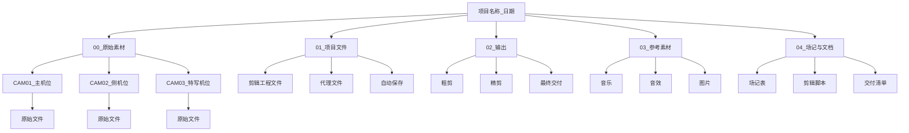

# 10.03 素材管理与剪辑文件结构

## 核心概念概述

素材管理是后期制作中最容易被忽视、却对工作效率影响最大的环节。一个杂乱无章的素材库会导致剪辑师花费大量时间寻找素材、重命名文件、处理丢失素材等问题，这些时间原本可以用于创作本身。

良好的素材管理体系包含三个层面：规范的文件命名、清晰的文件夹结构、完整的场记与元数据记录。三者共同构成了高效剪辑工作流的基石。

## 一、素材管理的核心原则

### 拍摄结束即开始管理

素材管理不应等到剪辑阶段才开始。拍摄结束后，第一件事应是拷贝素材并进行规范化整理，而非将素材堆积在硬盘角落等待处理。

### 一致性优先

命名规则、文件夹结构等一旦确定，应在整个项目周期内保持一致。在项目开始前就制定规范，所有成员遵循同一标准，可避免后期因格式混乱而浪费大量时间。

### 冗余备份

素材是视频项目中最宝贵的资产。在所有整理工作开始前，应先完成至少两份独立存储介质的备份。一份用于剪辑工作，一份作为安全备份。

## 二、文件命名规范

文件命名是素材管理中最基础、最重要的环节。规范化的命名使素材在文件管理器中和剪辑软件的时间线中都一目了然。

推荐的命名格式为：

`[项目编号]_[日期]_[机位编号]_[场景描述]_[序号]`

**示例**：`PRJ2025_20260615_CAM01_OpeningSpeech_001.MP4`

各字段说明如下：

| 字段 | 说明 | 示例 |
| :--- | :--- | :--- |
| 项目编号 | 项目唯一标识符 | PRJ2025、SES-0001 |
| 日期 | YYYYMMDD格式 | 20260615 |
| 机位编号 | 多机位标识，单机位可省略 | CAM01、CAM02 |
| 场景描述 | 英文或拼音缩写 | Opening、Interview、Award |
| 序号 | 同一场景下连续编号 | 001、002、003 |

此命名规范的目的是在任何时候、任何设备上，仅凭文件名即可识别素材的来源和内容，无需打开文件查看。

## 三、文件夹层级结构

规范的文件夹结构使项目中的所有文件各归其位，便于团队成员协作和长期存档。

各文件夹的功能说明如下。

**00_原始素材**：存储所有拍摄得到的原始文件，只读不写，保持原样。按机位或拍摄日期进一步细分。

**01_项目文件**：存储剪辑软件的工程文件、代理文件和自动保存备份。工程文件应定期手动保存并备份至此处。

**02_输出**：存储渲染输出的视频文件，按版本（粗剪、精剪、最终交付）分文件夹存放。

**03_参考素材**：存储背景音乐、音效、片头片尾模板、参考图片等外部素材。

**04_场记与文档**：存储场记表、剪辑脚本、交付清单等文字资料。

## 四、素材筛选与分级

在剪辑开始前进行初步筛选，可大幅提升后续剪辑效率。通常将素材分为三个等级：

| 等级 | 标记方式 | 说明 |
| :--- | :--- | :--- |
| 废片 | 删除或移入废片文件夹 | 失焦、过曝、穿帮等不可用素材 |
| 可用素材 | 标记为绿色或1星 | 可正常使用的素材 |
| 优选素材 | 标记为蓝色或2星以上 | 核心瞬间、最佳镜头 |

## 五、场记记录

场记是在素材拷贝时记录的关键信息，便于剪辑师快速定位特定内容。记录内容通常包括：

- **场景编号**：该素材属于哪个拍摄场景
- **内容描述**：素材中发生了什么
- **时间码范围**：该素材中最有价值片段的位置
- **备注**：特殊说明（如情绪、动作亮点等）

场记建议使用Excel表格记录，作为剪辑工作的辅助索引。

## 六、素材备份策略

### 双份备份原则

拍摄结束后，立即将存储卡中的素材拷贝至工作硬盘（硬盘A）。拷贝完成后，将同一份素材备份至备份硬盘（硬盘B）。确认两份拷贝均完整且可读后，再格式化存储卡。

### 备份频率建议

重要项目每天拍摄结束后立即备份当天素材。在拍摄周期较长的项目中，可设定每周增量备份。使用校验工具验证拷贝完整性，或手动抽查几个文件是否能正常打开。

## 七、常见误区与避坑指南

::: warning ⚠️ 避坑指南

**误区一：素材管理是后期才开始的工作，拍摄时不用管。**

拍摄时使用规范的命名格式、做好场记记录，可直接减少后期在素材整理上花费的时间。拍摄时的规范程度决定了后期的起始效率。

**误区二：文件夹结构越详细越好。**

过于复杂的文件夹结构可能让团队成员难以理解和遵循。保持层级在三到四级以内，每个文件夹的功能清晰明确，更容易被团队成员接受和执行。

**误区三：只需要在硬盘上保留最终剪辑用的素材即可。**

在项目交付后，应保留完整的原始素材、工程文件和输出文件，至少保存至项目交付后的一定期限。若需要进行修改或重新剪辑，原始素材是不可或缺的。
:::

## 总结

素材管理是高效后期制作的基础。规范的命名格式、清晰的文件夹结构、完整的场记记录和可靠的备份策略共同构成了素材管理的完整体系。在项目开始前制定并执行这些规范，可有效减少后期工作中因查找素材和处理混乱而浪费的时间。

下一节将进入《10.04 Proxy 代理文件工作流》，深入讲解代理文件的原理、生成与应用方法。